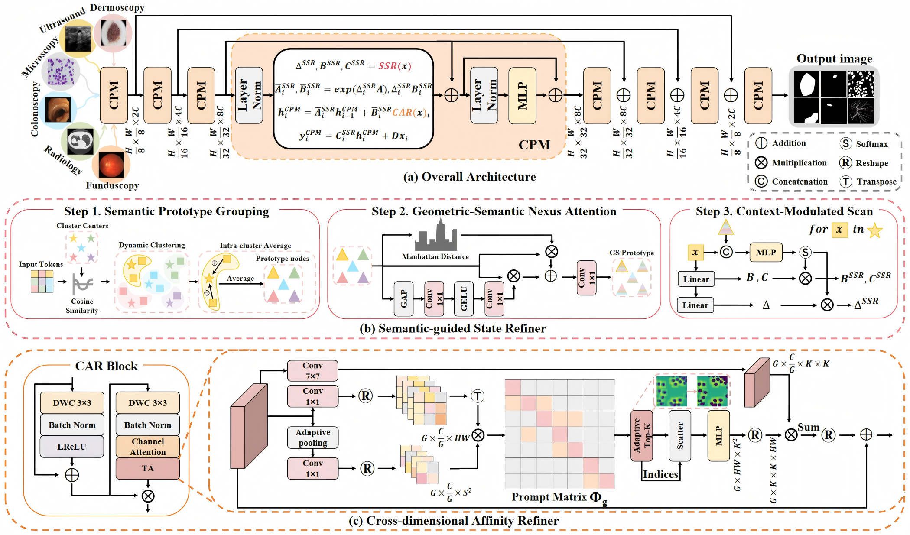

# GeoSemba (CVPR 2026)

**Reconstructing State Space Model for Cross Paradigm Representation in Medical Image Segmentation**

[](https://cvpr.thecvf.com/)
[](https://www.python.org/)
[](https://pytorch.org/)

> Xutao Sun, Jiarui Li, Junwen Liu, Yonggong Ren*
>


## 📄 Abstract

Mamba-based models have emerged as a promising paradigm for medical image segmentation due to their linear-complexity state-space modeling. However, their effectiveness is still limited by the mismatch between anatomical geometry and tissue-specific semantics, as well as by spatially entangled diagnostic cues. To address these limitations, we propose **GeoSemba**, a Mamba-based segmentation framework that jointly models cross-level geometric-semantic interactions and cross-dimensional spatial-channel dependencies within a single scan. GeoSemba is instantiated with two dedicated components. The **Semantic-guided State Refiner (SSR)** derives semantically discriminative region representatives and leverages geometry-conditioned inter-region dependencies to enable coherent semantic propagation across structurally related regions. The **Cross-dimensional Affinity Refiner (CAR)** adopts a coarse-to-fine strategy of macro-perception and micro-focus to selectively enhance informative spatial-channel interactions while suppressing weak and noisy correlations. Extensive experiments on benchmark datasets spanning six medical imaging modalities show that GeoSemba consistently delivers superior segmentation accuracy while maintaining high computational efficiency.

## 📖 Overview

GeoSemba is a Mamba-based medical image segmentation framework that reformulates state-space modeling to jointly capture **cross-level geometric-semantic interactions** and **cross-dimensional spatial-channel dependencies** within a single scan.

### Core Innovations

- **Semantic-guided State Refiner (SSR)**: Derives semantically discriminative region representatives from task-discriminative features and spatial centroids, leveraging geometry-conditioned inter-region dependencies to enable coherent semantic propagation across structurally related regions
- **Cross-dimensional Affinity Refiner (CAR)**: Adopts a coarse-to-fine strategy of macro-perception and micro-focus to selectively enhance informative spatial-channel interactions while suppressing weak and noisy correlations

<p align="center">
  
</p>


## 📝 Citation

If this work is helpful for your research, please cite:

```bibtex
@inproceedings{sun2026geosemba,
  title={GeoSemba: Reconstructing State Space Model for Cross Paradigm Representation in Medical Image Segmentation},
  author={Sun, Xutao and Li, Jiarui and Liu, Junwen and Ren, Yonggong},
  booktitle={Proceedings of the IEEE/CVF Conference on Computer Vision and Pattern Recognition (CVPR)},
  year={2026}
}
```

## 🙏 Acknowledgements

This project is built upon the following excellent works:
- [Mamba](https://github.com/state-spaces/mamba)
- [VMamba](https://github.com/MzeroMiko/VMamba)
- [U-Net](https://github.com/milesial/Pytorch-UNet)

## 📄 License

This project is licensed under the [Apache License 2.0](LICENSE).
